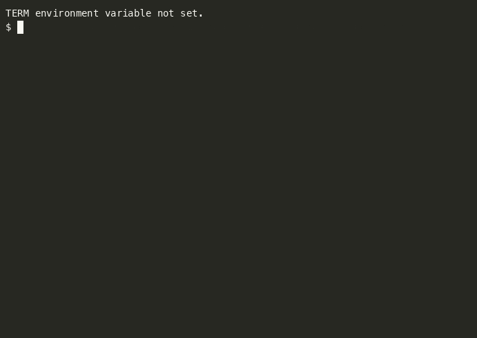

# Custom Agents

A library of ready-made [Claude Code](https://claude.com/claude-code) subagents — specialized, read-mostly assistants for code review, testing, investigation, architecture, documentation, and operations. Drop them into any project and Claude Code will route to them automatically.

Each `.md` file is a self-contained subagent: YAML frontmatter (`name`, `description`, `tools`) followed by its system prompt.

## Demo

`code-reviewer` catching a SQL injection bug in [demo/sample-code/users.py](demo/sample-code/users.py):

```bash
claude -p "use the code-reviewer subagent on demo/sample-code/users.py"
```



## Agents

### code-quality-and-review/

| Agent | Purpose | Tools |
|---|---|---|
| [code-reviewer](code-quality-and-review/code-reviewer.md) | Bugs, readability, edge cases | Read, Grep, Glob |
| [security-reviewer](code-quality-and-review/security-reviewer.md) | Injection, secrets, auth gaps, unsafe deserialization | Read, Grep, Glob |
| [performance-reviewer](code-quality-and-review/performance-reviewer.md) | N+1 queries, blocking async calls, hot loops, missing indexes | Read, Grep, Glob |
| [api-contract-checker](code-quality-and-review/api-contract-checker.md) | Breaking changes to APIs/schemas/response shapes | Read, Grep, Glob |
| [dependency-auditor](code-quality-and-review/dependency-auditor.md) | Unpinned/outdated/risky packages, license issues | Read, Grep, Glob, Bash (read-only) |

### testing/

| Agent | Purpose | Tools |
|---|---|---|
| [test-writer](testing/test-writer.md) | Writes unit tests following existing conventions | Read, Write, Edit, Bash |
| [test-debugger](testing/test-debugger.md) | Runs failing tests, finds root cause from stack trace | Read, Grep, Bash |
| [flaky-test-hunter](testing/flaky-test-hunter.md) | Reruns tests, spots nondeterminism | Bash, Read |
| [coverage-gap-finder](testing/coverage-gap-finder.md) | Finds untested branches in critical paths | Read, Bash |

### investigation-and-understanding/

| Agent | Purpose | Tools |
|---|---|---|
| [codebase-explorer](investigation-and-understanding/codebase-explorer.md) | Traces a flow across the codebase, returns a map | Read, Grep, Glob |
| [incident-investigator](investigation-and-understanding/incident-investigator.md) | Reads logs/commits/config to propose a likely root cause | Read, Grep, Bash |
| [impact-analyser](investigation-and-understanding/impact-analyser.md) | Finds all callers/dependents before you change something | Read, Grep, Glob |
| [legacy-archaeologist](investigation-and-understanding/legacy-archaeologist.md) | Explains old, undocumented code and why it likely exists | Read, Grep, Bash |

### architecture-and-design/

| Agent | Purpose | Tools |
|---|---|---|
| [architecture-reviewer](architecture-and-design/architecture-reviewer.md) | Checks a change against ADRs and layering rules | Read, Grep |
| [design-critic](architecture-and-design/design-critic.md) | Argues against a proposed design; finds failure modes | Read |
| [migration-planner](architecture-and-design/migration-planner.md) | Maps what a framework/DB/version migration touches, in order | Read, Grep, Glob |
| [tech-debt-surveyor](architecture-and-design/tech-debt-surveyor.md) | Ranks debt hotspots by churn, complexity, risk | Read, Bash |

### documentation/

| Agent | Purpose | Tools |
|---|---|---|
| [doc-writer](documentation/doc-writer.md) | READMEs, docstrings, runbooks from the actual code | Read, Write |
| [changelog-writer](documentation/changelog-writer.md) | Turns commits and PRs into release notes | Bash, Write |
| [doc-drift-checker](documentation/doc-drift-checker.md) | Finds docs that no longer match the code | Read, Grep |

### operations-and-delivery/

| Agent | Purpose | Tools |
|---|---|---|
| [deploy-checker](operations-and-delivery/deploy-checker.md) | Verifies migrations, flags, config, rollback plan before release | Read, Bash |
| [config-auditor](operations-and-delivery/config-auditor.md) | Debug mode left on, permissive CORS, missing env vars | Read, Grep |
| [log-analyser](operations-and-delivery/log-analyser.md) | Summarizes error patterns from large log files | Read, Grep, Bash |

## Install

Claude Code loads subagents from `.claude/agents/`. Copy in whichever ones you want:

```bash
# one category
mkdir -p .claude/agents
cp path/to/custom-agents/code-quality-and-review/*.md .claude/agents/

# everything
cp path/to/custom-agents/*/*.md .claude/agents/
```

Use `~/.claude/agents/` instead of `.claude/agents/` to install user-wide, across every project. Picked up automatically — no restart needed.

## Run

Ask naturally and Claude Code routes to the right agent by its `description`:

```
review this diff for security issues
```

Or name one explicitly:

```
use the api-contract-checker subagent on src/api/users.ts
```

Same from the shell, non-interactively:

```bash
claude -p "use the code-reviewer subagent on src/payments/"
```

Every agent here is read-mostly: reviewers/investigators use `Read`/`Grep`/`Glob` (and sometimes read-only `Bash`) and never edit files. `test-writer` and `doc-writer` are the exception — they write files, since that's their job.

## Add a new agent

Create `<name>.md` under a category folder (or a new one):

```yaml
---
name: my-agent
description: When Claude should use this, written so it also triggers proactively when relevant.
tools: Read, Grep, Glob
---
Role in one line.

Focus:
- what to look for, in priority order

Output: the expected format of its findings.
```

Install it, then add a row to the matching table above.

## Contributing

PRs adding new agents or tightening existing prompts are welcome. Keep each agent's prompt short — focus areas as bullets, one output-format line — and scope its `tools` to the minimum it actually needs.

## License

MIT.
